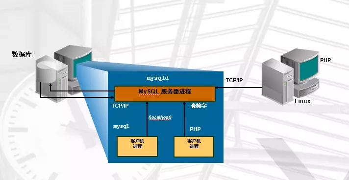
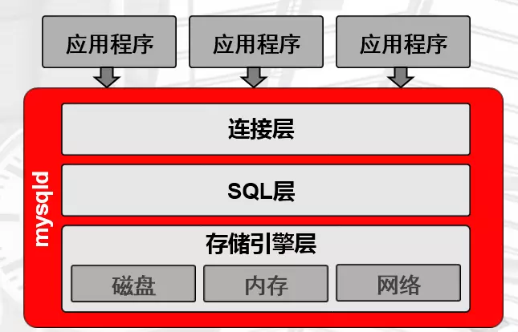
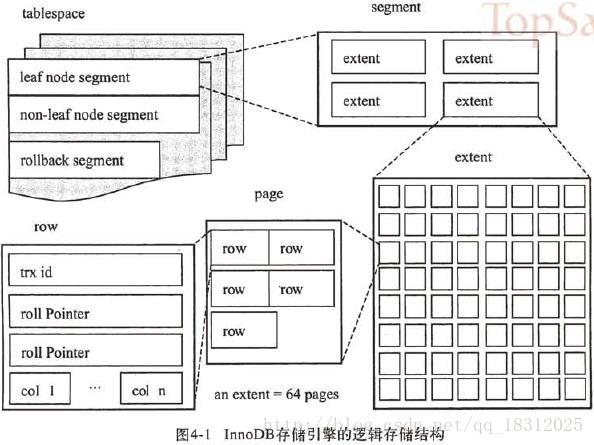

## mysql

### 安装

#### 1.MySQL分类

```	
DBMS：数据库管理系统
	rdbms：关系型数据库
		orcacle，mysql，mssql，pg，db2
	nosql：非关系型数据库
		redis，mongodb，memcached，es，hbase
	newsql：分布式(云)数据库架构
		tidb(挺火)，polardb(阿里云)
```

#### 2.mysql产品分支

```
oracle mysql 5.6 5.7 8.0
mariadb 10.x
percona 5.6 5.7 8.0
```

#### 3.mysql版本选择

```
5.6
	企业内使用：5.6.34 5.6.36 5.6.38 5.6.40 比较主流，明年可能会停止更新
	一般都更新到8.0版本
5.7 
	企业内使用：5.7.18 5.7.20(ga时间:2017.9.13号) 5.7.22
8.0
	企业内使用：8.0.14
5.6.38和5.7.20都是在2017.9.13号发布的社区稳定版
```

#### 4.mysql5.7.26二进制版本安装

```
1.创建关键目录
软件目录：
	官方放在usr/local目录下
	mkdir -p /usr/local/mysql
数据目录：
	一般生产环境都将数据和mysql分开存储，在mysql服务器上挂载一个新的磁盘用于存取数据
	mkdir -p /data/
2.添加存储磁盘，并自动挂载在/data目录
	格式化磁盘:mkfs.xfs /dev/sdb
	挂载磁盘：mount /dev/sdb /data
	自动挂载：
		获取磁盘的uuid：blkid
		vim /etc/fstab
			UUID=8016c99b-9b25-4676-8649-16e6cc6e2de4 /data xfs     defaults        0 0
	测试自动挂载：
		umount /data然后df -h,在mount -a
3 创建数据目录和日志目录
	mkdir  -p /data/mysql/data /data/binlog
4.解压源码包
	tar -zxvf /usr/local/mysql-5.7.26-linux-glibc2.12-x86_64.tar.gz
	mv mysql-5.7.26-linux-glibc2.12-x86_64.tar.gz mysql --->/usr/local/mysql
5.创建用户并授权
	官方要求是非root用户
		useradd mysql
	授权用户数据目录和软件目录
		chown -R mysql. /data /usr/local/mysql
6.设置环境变量
 	vim /etc/profile
	export PATH=/usr/local/mysql/bin:$PATH
	source /etc/profile
	[root@centos7-node1 local]# mysql -V
	mysql  Ver 14.14 Distrib 5.7.26, for linux-glibc2.12 (x86_64) using  EditLine wrapper
7.删除mariadb数据库的软件包
	查看mariadb：rpm -qa|grep mariadb
	删除mariadb: yum remove mariadb-libs -y 
8.数据初始化(很重要)
	mysql5.6初始化：mysql_install_db
	mysqld --initialize-insecure --user=mysql --basedir=/usr/local/mysql --datadir=/data/mysql/data
	如果报错的话：yum install libaio-devel -y 
	mysqld:启动命令和初始化命令
	--initialize-insecure：初始化专用参数，以不安全的方式初始化
	--initialize：以安全的方式初始化
		1.生成随机12位的出密码(大小写，数字，符号)
		2.要求所有以后的密码都要具有复杂度
		3.密码过期时间默认180天
	/data/mysql/data里面的内容就是初始化之后生成的，如果参数写的有误，将该目录清空，重新初始化
9.配置文件 /etc/my.cnf
    [mysqld]
    user=mysql
    basedir=/usr/local/mysql
    datadir=/data/mysql/data
    socket=/tmp/mysql.sock
    server_id=51
    [mysql]
    socket=/tmp/mysql.sock
    
10.准备启动脚本
sys-V的启动方式(centos6以及之前的启动方式)
	mysql安装目录里面自带了一个启动脚本/usr/local/mysql/support-files
	将mysql-server复制到/etc/init.d/mysqld cp mysql.server /etc/init.d/mysqld
	启动：service mysqld start	或者 /etc/init.d/mysqld start	或者./mysql.server start
systemd启动方式(centos7以后的操作)
    vim /etc/systemd/system/mysqld.service (下面的是system官方的启动脚本)
    [Unit]
    Description=MySQL Server
    Documentation=man:mysqld(8)
    Documentation=http://dev.mysql.com/doc/refman/en/using-systemd.html
    After=network.target
    After=syslog.target
    [Install]
    WantedBy=multi-user.target
    [Service]
    User=mysql
    Group=mysql
    ExecStart=/usr/local/mysql/bin/mysqld --defaults-file=/etc/my.cnf  
    # 这块要找到自己的mysql安装路径
    LimitNOFILE = 5000
    
    注意：systelctl与sys-V模式的无法通用。
    先使用sysv关闭,在启动
    [root@db01 ~]# /etc/init.d/mysqld stop
    [root@db01 ~]# systemctl start mysqld
11.给mysql设置密码
	mysqladmin -uroot -p password root@123
```

#### 5.基本使用

```
查看用户数据：
	select host,user,authentication_string from mysql.user;(5.7之前是password)
查看表结构：
	desc mysql.user;
```

### 体系结构和管理

#### 1.cs架构



```
通过客户端连接到服务器去管理
1.c/s工作模型
    mysql的连接方式：
    tcp/ip:
        mysql -uroot -proot@123 -P3306 -hlocalhost
    socket(本地连接)
        mysql -uroot -proot@123 -S /tmp/mysql.sock
2.实例
	与ssh，nginx等程序一样，mysql也是有守护进程的，方便连接，降低资源消耗
	并且，在内存中分割了一部分空间给mysqld守护进程，也就是预先分配好给mysql，达到高效和方便管理
	所以：
		实例= mysqld守护进程+master threads(主线程)+memory(预先分配好的内存)+work threads(干活)
```

#### 2.什么是sql

```
MySQL管理和使用专用的命令    相当于  Linux Bash Shell中自带的命令
DDL  数据定义语言
DCL  数据控制语言  
DML  数据操作语言
DQL  数据查询语言
```

#### 3.mysqld详解



```
查看mysqld的进程：ps -ef|grep mysqld
查看mysql线程： lsof也可以查看
	top -H -p mysqld进程号
	ps -T -p mysqld进程号
注意：
	mysql出现故障或性能问题80%以上都是人为的。
```

##### 一条sql语句的执行流程

###### 连接层

```
1.提供请求连接协议：TCP/IP Socket
2.提供验证：用户、密码，IP，SOCKET(主要验证提交的数据是否合法)
3.提供专用连接线程：接收用户SQL，将sql语句提交给sql层，并等待返回结果。
通过以下语句可以查看到连接线程基本情况
mysql> show processlist;

专用连接线程：
	每一个用户链接上了，就提供一个线程，将用户的sql语句接收到，并交给sql层做处理，等待结果返回给用户。
```

###### sql层

```
1.接受连接层sql语句
2.语法验证模块：验证语句语法,是否满足SQL_MODE，一些不安全的sql语句是不被执行的，执行时更加规范。
3.语义检查：判断SQL语句的类型
    DDL:数据定义语言
    DCL:数据控制语言
    DML:数据操作语言
    DQL:数据查询语言
4.权限检查：用户对库表有没有权限
5.预处理：
	解析器：对语句执行前,进行预处理，生成解析树(执行计划),说白了就是生成多种执行方案.
	优化器：根据解析器得出的多种执行计划，进行判断，选择最优的执行计划
        代价模型：资源（CPU IO MEM）的耗损评估性能好坏
6.执行器：根据最优执行计划，执行SQL语句，产生执行结果
	执行结果：在磁盘的xxxx位置上(段，区，页)，将结果交给存储引擎层继续处理
7.提供查询缓存（默认是没开启的），会使用redis tair替代查询缓存功能
	8.0以前mysql使用query_cache来进行做缓存，但是有点鸡肋。
	将执行语句hash处理，并缓解结果，但是将sql语句换了之后，hash就变了，这样缓存就不会命中。
8.提供日志记录（日志管理章节）：binlog，默认是没开启的。
	备份数据，数据恢复，实时同步，主从复制等等都需要使用binlog
```

###### 存储引擎层

```
1.接受sql层的执行结果
2.负责根据SQL层执行的结果，从磁盘上拿数据。
3.将16进制的磁盘数据，结构化成表，交返回给SQL层，
4.连接层的专用线程返回给用户。
```

#### 4.mysql结构

##### mysql逻辑结构


```
库：database(schema)
	库名，库属性
	查看库属性：show create database mysql;
表：也叫二维表或者对象 table
	表名，表属性
	列:列名(字段),列属性(数据类型,约束等)
	数据行(记录)
	查看表属性：desc mysql.user;
```

##### mysql物理结构


```
库：
	就是在mysql的存放数据的目录。库名和文件名相同。
	可以在目录中新建abc，在mysql中查看。
	用文件系统的目录来存储
表：
	针对不同存储引擎，表的结构是不同的。
	MyISAM存储引擎 :
        user.frm:列定义信息
        user.MYD:数据行
        user.MYI:索引 
	InnoDB存储引擎   :
        time_zone.frm:列定义信息 
        time_zone.ibd:数据行和索引
```

##### 表的段，区，页。



```
文件系统是为了更高效的使用扇区，8个扇区(512b)是一个block块(4kb)。
	page(页)：mysql中最小的存储单元，大小为16kb，是最小的io单元。
		1个page--->4个block块(4kb)--->32个扇区(512b)
	extent(区)：为了预处理而设计的理念，大小为1m。
		特别是在range查找范围的时候，会连续分配64个page页。
	segment(段)：一个文件就是一个段。一个表就是一个段
		比如test.ibd就是一个段，是一个或多个区组成的。(分区表除外)
这样设计是为了能够尽量快速使用磁盘的扇区，会有倍数的关系。
```

#### 5.管理

##### 1.用户和权限管理

```
用户的作用：
	登录mysql，管理mysql
用户什么样子的？
	用户名@'白名单'
	白名单：一般是ip，域名或者是ip段
	wordpress@'localhost' 允许wordpress用户在本地访问
	wordpress@'10.0.0.200' 允许wordpress用户通过10.0.0.200访问
	wordpress@'10.0.0.%' 允许wordpress用户通过10.0.0.x段访问
	wordpress@'10.0.0.5%' 允许wordpress用户通过10.0.0.51-59机器访问
	wordpress@'10.0.0.0/255.255.254.0' 
    wordpress@'%'      允许wordpress用户通过所有机器访问
    wordpress@'db02'   允许wordpress用户通过所有db02访问
```

##### 2.创建用户

```
1.创建一个无密码的用户
	create user kobe@'192.168.16.%';
2.查询用户
	select  host,user,authentication_string from mysql.user;
3.修改用户密码
	alter user kobe@'192.168.16.%' identified by 'root@123';
4.创建带密码的用户
	create user kobe@'192.168.16.%' identified by 'root@123';
5.删除用户
	drop user kobe@'192.168.16.%';

```

##### 3.授权

```
创建用户并授权(仅限于8.0以前，8.0版本是先创建用户，在授权)
grant all on *.* to kobe@'192.168.16.%' identified by 'root@123';

GRANT 权限 ON 库.表范围 TO 用户 IDENTIFIED BY '密码'

al：
	SELECT,INSERT, UPDATE, DELETE, CREATE, DROP, RELOAD, SHUTDOWN, PROCESS, FILE, 		REFERENCES, INDEX, ALTER, SHOW DATABASES, SUPER, CREATE TEMPORARY TABLES, LOCK TABLES, EXECUTE, REPLICATION SLAVE, REPLICATION CLIENT, CREATE VIEW, SHOW VIEW, CREATE ROUTINE, ALTER ROUTINE, CREATE USER, EVENT, TRIGGER, CREATE TABLESPACE
	以上所有权限，一般是普通管理员拥有的
	with grant option：超级管理员才具备的，给别的用户授权的功能,
范围：
	*.* 所有库的所有表
	wordpress.* wordpress数据库的所有表
	wordpress.text wordpress数据库中的text表
	
创建一个超级管理员用户：
	grant all on *.* to admin@'%' identified by 'admin' with grant option;
创建一个数据库级别的用户：
	grant all on *.* to test@'%' identified by 'test';
创建一个列级别的用户：
	grant select (id, col1) on wordpress.text to test@'%' identified by 'test';
创建一个程序级别的用户：
	grant execute on wordpress.text to test@'%' identified by 'test';	 
查看用户权限：
	show grants for kobe@'192.168.16.%';
实时刷新:
	flush privileges;
```

##### 4.回收权限

```
mysql对用户多次授权是权限累加的，不是覆盖的，所以要进行权限回收的时候要注意是否多次授权。
回收权限
	revoke delete on wordpress.* from app@'192.168.16.%';
回收管理员权限
	revoke grant option on *.* from admin@'192.168.16.%';
	
	
	
```


