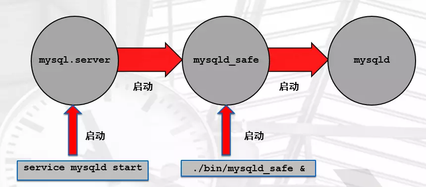

### mysql连接层基础应用

#### 注意

```
每一个表都可以设置存储引擎，并且注意：存储引擎是基于表的，而不是数据库的。
innodb的特有的表示索引组织表。
在mysql中执行系统命令
	mysql> system ls -al /tmp
```

#### 1.mysql的连接管理

##### 前提

```
前提是有授权好的用户。
第一种:socket链接方式(管理员使用本地使用user@'localhost')
	mysql自带命令
        -u 用户
        -p 密码
        -h IP
        -P 端口
        -S socket文件
        -e 免交互执行命令
        <  导入SQL脚本
	使用：
		mysql -uroot -p 默认是socket连接的，默认省略 -S /tmp/mysql.sock
		
	查看socket的位置：
		netstat -lnp|grep mysqld
		因为mysql的二进制版本默认将mysql.sock存在/tmp目录下，在指定配置文件的时候也是默认放在/tmp目录
	
	如何查看链接方式：
		show processlist;命令中的Host可以体现出来
第二种:tcp/ip连接的方式(网络socket)
	在登录的时候，即使用socket又使用tcpip的模式的时候，默认使用的是tcpip连接的
	其他参数：
		-e参数:主要用于在写脚本你的时候使用。
		mysql -uroot -pxx -e "grant all on *.* to a@'192.168.16.%' identified by 'a';"
		mysql -uroot -pxx -e "show grants for a@'192.168.16.%'";
		mysql -uroot -p -e "show databases;"

第三方工具：
	sqlyog
	navicat

```

#### 2.忘记root密码

```
分析：
	首先应该是在连接层进行账号密码校验的，可以将账号密码校验功能关闭。但是这样，可能造成所有用户都不用输入账号密码就可以登录，所以还要关闭tcpip的连接协议。这样，减少了网络socket的请求。只要登录上这台mysql的服务器。然后就可以修改密码了。
	禁止验证:--skip-grant-tables
	禁止tcp/ip协议:--skip-networking
	
实现：
	1.可以记载配置文件里面
	2.通过mysqld_safe命令，可以添加一次性的启动参数(sysv和systemd不能添加参数)
		关闭数据库：systemctl stop mysqld
		后台启动：./mysqld_safe --skip-grant-tables --skip-networking &
		修改密码：alter user root@'localhost' identified by 'xxx';
			发现报错，因为在启动的时候已经禁止授权表的加载，所以上述命令不生效！
		刷新数据库，加载授权表：flush privileges;
		修改密码：alter user root@'localhost' identified by 'xxx';
		重新启动数据库：systemctl restart mysqld	
	3.通过mysqld_safe的方式启动数据库，直接所有的用户都不需要密码，直接登录。
```

#### 3.mysql的其他启动关闭方式



```
脚本式启动方式，实现mysqld启动(日常使用)
	/etc/init.d/mysqld start stop restart status
		mysql.server --->mysqld_safe--->mysqld
	systemctl  start restart stop status mysqld
		其实也是直接调用的/usr/local/mysql/bin/mysqld --defaults-file=/etc/my.cnf
直接调用启动程序，实现mysqld启动(临时维护使用)
	注意：只能启动，不能关闭
	./mysqld_safe &    # 注意默认是前台启动，使用service mysqld stop
		优点：可以临时添加参数 ./,mysqld_safe --socket=/tmp/aaa.sock &
	mysqld & 可以以直接启动  # 当数据库起不来的时候，可以尝试性操作
		which mysqld --->/usr/local/mysql/bin/mysqld
		file /usr/local/mysql/bin/mysqld --->ELF 64-bit LSB executable,version 1 (SYSV),
		/usr/local/mysql/bin/mysqld --defaults-file=/etc/my.cnf  # 强制使用该配置文件
关闭数据库：
	mysqladmin -uroot -pxxx shutdown
	pkill mysqld
```

#### 4.mysql初始化配置

```
1.常用方法(参数优先级从高到低排列)
	命令行
	配置文件
	编译安装的过程
2.配置文件读取顺序
	mysqld --help --verbose|grep my.cnf
	注意：
		mysql加载配置时按照：不重复的配置就加载，重复的配置就读取最后一个的配置文件为准
		
	强制使用配置文件，而不按照顺序读取
		/usr/local/mysql/bin/mysqld --defaults-file=/etc/my.cnf  # 强制使用该配置文件
3.配置文件的结构和语法
	作用：
		影响到数据库启动(服务端)
		影响到客户端连接
	结构
        [标签]
            配置 
        [标签]
            配置
            
        服务端: [server]
            [mysqld] 
            [mysqld_safe]
        
        客户端: [client]
            [mysql]
            [mysqldump]
            [mysqladmin]       	   

	配置文件模板 
        [mysqld]
        user=mysql 
        basedir=/usr/local/mysql        # 软件存放路径
        datadir=/data/mysql/data        # 数据目录
        log_error=/data/mysql/mysql.log # 错误日志路径
        socket=/tmp/mysql.sock          # socket文件位置 
        port=3306 						# 端口
        server_id=10 					# 服务ID 
        log_bin=/data/binlog	
        [mysql] 
		socket=/tmp/mysql.sock   # 有此条配置的话可以在连接mysql -uroot -pxxx的时候省略-S参数
		user=root
		password=123
		
		如果mysql的账号密码配置正确，以后在mysqld服务器上使用mysql的时候，就不需要账号密码
		# 这个 [mysql] 的配置只是在本地有效。
```

#### 5.mysql多实例

```
说白了就是一台服务器上运行了多个数据库管理系统(mysqld+master thread+worker thread +共享的内存)
注意：
	一般应用在中大型架构和巨型架构较多

首先：关闭掉正在运行的mysql
1.准备多个目录：
	mkdir -p /data/330{7,8,9}/data
2.准备配置文件
cat > /data/3307/my.cnf <<EOF
[mysqld]
basedir=/usr/local/mysql
datadir=/data/3307/data
socket=/data/3307/mysql.sock
log_error=/data/3307/mysql.log
port=3307
server_id=7
log_bin=/data/3307/mysql-bin
EOF

cat > /data/3308/my.cnf <<EOF
[mysqld]
basedir=/usr/local/mysql
datadir=/data/3308/data
socket=/data/3308/mysql.sock
log_error=/data/3308/mysql.log
port=3308
server_id=8
log_bin=/data/3308/mysql-bin
EOF

cat > /data/3309/my.cnf <<EOF
[mysqld]
basedir=/usr/local/mysql
datadir=/data/3309/data
socket=/data/3309/mysql.sock
log_error=/data/3309/mysql.log
port=3309
server_id=9
log_bin=/data/3309/mysql-bin
EOF
	
3.初始化三套数据
备份使用过的配置文件：mv /etc/my.cnf /etc/my.cnf.bak
mysqld --initialize-insecure  --user=mysql --datadir=/data/3307/data --basedir=/usr/local/mysql
mysqld --initialize-insecure  --user=mysql --datadir=/data/3308/data --basedir=/usr/local/mysql
mysqld --initialize-insecure  --user=mysql --datadir=/data/3309/data --basedir=/usr/local/mysql

4.systemd多实例管理
cd /etc/systemd/system
cp mysqld.service mysqld3307.service
cp mysqld.service mysqld3308.service
cp mysqld.service mysqld3309.service

vim mysqld3307.service
ExecStart=/usr/local/mysql/bin/mysqld  --defaults-file=/data/3307/my.cnf
vim mysqld3308.service
ExecStart=/usr/local/mysql/bin/mysqld  --defaults-file=/data/3308/my.cnf
vim mysqld3309.service
ExecStart=/usr/local/mysql/bin/mysqld  --defaults-file=/data/3309/my.cnf

5.授权
chown -R mysql.mysql /data/*

6.启动
systemctl start mysqld3307.service
systemctl start mysqld3308.service
systemctl start mysqld3309.service

7.验证多实例
netstat -lnp|grep 330
mysql -S /data/3307/mysql.sock -e "select @@server_id"
mysql -S /data/3308/mysql.sock -e "select @@server_id"
mysql -S /data/3309/mysql.sock -e "select @@server_id"
```


