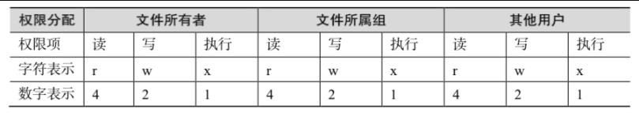

# **linux基础指令**

## linux文档目录结构

### 安装指令包

```python
yum install  net-tools -y
```

### linux目录结构特点

```python
1.目录树的起始点是根目录(/,root);
2.每一个目录不止能使用本地的文件系统，也可以使用网络上的文件系统，可以利用NFS服务器挂载特定目录。
3.每一个文件在此目录树中的文件名，包含完整路径都是独一无二的。
```


### linux目录结构

```python
#/bin
	bin是Binary的缩写, 这个目录存放着最经常使用的命令
#/boot
	这里存放的是启动Linux时使用的一些核心文件，包括一些连接文件以及镜像文件
#/dev
	dev是Device(设备)的缩写, 该目录下存放的是Linux的外部设备，在Linux中访问设备的方式和访问文件的方式是相同的
#/etc
	这个目录用来存放所有的系统管理所需要的配置文件和子目录。
#/home
	用户的主目录，在Linux中，每个用户都有一个自己的目录，一般该目录名是以用户的账号命名的
#/lib
	这个目录里存放着系统最基本的动态连接共享库，其作用类似于Windows里的DLL文件。几乎所有的应用程序都需要用到这些共享库
#/lost+found
	这个目录一般情况下是空的，当系统非法关机后，这里就存放了一些文件
#/media
	linux系统会自动识别一些设备，例如U盘、光驱等等，当识别后，linux会把识别的设备挂载到这个目录下
#/mnt
	系统提供该目录是为了让用户临时挂载别的文件系统的，我们可以将光驱挂载在/mnt/上，然后进入该目录就可以查看光驱里的内容了
#/opt
	这是给主机额外安装软件所摆放的目录。比如你安装一个ORACLE数据库则就可以放到这个目录下。默认是空的
#/proc
	这个目录是一个虚拟的目录，它是系统内存的映射，我们可以通过直接访问这个目录来获取系统信息
    这个目录的内容不在硬盘上而是在内存里，我们也可以直接修改里面的某些文件，比如可以通过下面的命令来屏蔽主机的ping命令，使别人无法ping你的机器：echo 1 > /proc/sys/net/ipv4/icmp_echo_ignore_all
#/root
	该目录为系统管理员，也称作超级权限者的用户主目录
#/sbin
	s就是Super User的意思，这里存放的是系统管理员使用的系统管理程序
#/selinux
	这个目录是Redhat/CentOS所特有的目录，Selinux是一个安全机制，类似于windows的防火墙，但是这套机制比较复杂，这个目录就是存放selinux相关的文件的
#/srv
	该目录存放一些服务启动之后需要提取的数据
#/sys
	这是linux2.6内核的一个很大的变化。该目录下安装了2.6内核中新出现的一个文件系统 sysfs,
sysfs文件系统集成了下面3种文件系统的信息：针对进程信息的proc文件系统、针对设备的devfs文件系统以及针对伪终端的devpts文件系统。该文件系统是内核设备树的一个直观反映,当一个内核对象被创建的时候，对应的文件和目录也在内核对象子系统中被创建
#/tmp
	这个目录是用来存放一些临时文件的
#/usr
	这是一个非常重要的目录，用户的很多应用程序和文件都放在这个目录下，类似于windows下的program files目录
#/usr/bin
	系统用户使用的应用程序
#/usr/sbin
	超级用户使用的比较高级的管理程序和系统守护程序
#/usr/src
	内核源代码默认的放置目录
#/var
	这个目录中存放着在不断扩充着的东西，我们习惯将那些经常被修改的目录放在这个目录下。包括各种日志文件
```

### linux快捷键

```python
1.tab键    用于自动补全命令/文件名/目录名
2.ctrl + l　　清理终端显示 
3.clear/cls  清理终端显示
4.ctrl + c 终止当前操作
5.ctrl + d 退出登陆
6.ctrl + shift +r 快速登陆
```

### linux开关机指令

```python
reboot命令用于重启机器
poweroff用于关闭系统
```


## 目录相关操作


### ls指令常用参数

```python
-a	显示指定目录下所有子目录与文件,包括隐藏文件
-l	以列表的方式显示文件的详细信息
-h	配合-l以人性化的方式显示文件大小
```


### 切换基础指令

```python
.    	当前目录
..      上一层目录
-    	前一个工作目录
~    	当前【用户】所在的家目录
pwd 	查看当前工作目录
```

### mkdir创建目录

```python
mkdir是make directory的缩写，用来建立新目录，
#创建文件夹(只能创建一个文件夹)
	mkdir ./python
	mkdir /home/oldboy/python
#递归创建文件夹
	mkdir -p /home/oldboy/python
	mkdir -p /home/{data1,data2,data3}
```

### rmdir删除目录

```python
#rmdir 删除空的文件夹(默认有提示;确认删除)
	rmdir /tmp/oldboy 
#递归删除文件或目录(默认有提示:确认删除)
	rm -r
#强制删除文件或目录
	rm -f
#递归强制删除文件和目录(慎用)
	rm -rf
```

### linux环境变量PATH

```python
#查看环境变量
	echo $PATH
    PATH(一定是大写的)这个变量是由一堆目录组成，分隔符是":"号，而不同于windows的";"号。
```

### 绝对路径和相对路径

```python
#绝对路径：由根目录(/)为开始写起的文件名或者目录名称，如/home/oldboy/test.py;
#相对路径：相对于目前路径的文件名写法。例如./home/oldboy/exam.py,简单来说只要开头不是/，就是属于相对路径
#实例:
	cd /var/log (绝对路径)
	cd ../var/log(相对路径)
```

## **VIM编辑器使用**

### VIM概念

```python
vim 具有程序编辑的能力，可以主动的以字体颜色辨别语法的正确性，方便程序设计。
Vim是从 vi 发展出来的一个文本编辑器。代码补完、编译及错误跳转等方便编程的功能特别丰富，在程序员中被广泛使用。
```

### VIM的三种模式

```python
基本上 vi/vim 共分为三种模式，分别是
	1:命令模式（Command mode），
	2:输入模式（Insert mode）
	3:底线命令模式（Last line mode）
```

### 命令模式

```python
用户刚刚启动 vi/vim，便进入了命令模式。
此状态下敲击键盘动作会被Vim识别为命令，而非输入字符。比如我们此时按下i，并不会输入一个字符，i被当作了一个命令
#移动光标
	w(e)　　移动光标到下一个单词
    b　　　　移动到光标上一个单词
    数字0　　移动到本行开头
    $　　　　移动光标到本行结尾
    H　　　　移动光标到屏幕首行
    M　　　　移动到光标到屏幕的中间一行
    L　　　　移动光标到屏幕的尾行
    gg　　　 移动光标到文档的首行
    G　　　　移动光标到文档尾行
    ctrl + f　　下一页
    ctrl + b　　上一页
    `.　　移动光标到上一次的修改行
#查找
	/chaoge     在整篇文档中搜索chaoge字符串,向下查找
	?chaoge     在整篇文档中搜索chaoge字符串,向上查找
    *        查找整个文档，匹配光标所在的所有单词,按下n查找下一处,N上一处
    #        查找整个文档，匹配光标所在的所有单词,按下n查找下一处,N上一处
    gd        找到光标所在单词匹配的单词，并停留在非注释的第一个匹配上
    %　　　　找到括号的另一半！！
#复制,删除,粘贴
    yy    拷贝光标所在行
    dd    删除光标所在行
    D     删除当前光标到行尾的内容
    dG    删除当前行到文档尾部的内容
    p     粘贴yy所复制的内容
    x　　 删除光标所在的字符
    u     撤销上一步的操作
# 数字与命令
	3yy　　拷贝光标所在的3行
	5dd　　删除光标所在5行
```

### 输入模式

```python
在命令模式下按下字母i,就可进入输入模式
#常用指令
	i	install进入输入模式,在光标当前位置输入
	a	append在文件末尾添加
	o	在光标下一行输入
```

### **底线命令模式**

```python
在命令模式下输入冒号（英文的:），就进入了底线命令模式，在底线命令模式下可以输入单个或多个字符的命令，常用命令有
    :q!     强制退出
    :wq!    强制写入退出
    :set nu 显示行号
    :数字　　调到数字那行
在输入模式下,先esc退出输入模式,在输入冒号,就可进入底线模式
随时按下esc可以退出底线命令模式
```


### vim按键指令

```python
#移动光标的方法
    h 或 向左箭头键(←)    光标向左移动一个字符
    j 或 向下箭头键(↓)    光标向下移动一个字符
    k 或 向上箭头键(↑)    光标向上移动一个字符
    l 或 向右箭头键(→)    光标向右移动一个字符
    向下移动5行　　　　　　5j
    向右移动10字符　　　　10l
    n(space)　　　　按下数字n,例如10，然后按下空格，光标会向右移动10个字符
```

### 底线指令

```python
:! command    暂时离开vim指令模式，执行command的结果
	例如  :!ip a    临时看一下ip信息，然后可以回到vim
#:set nu　　　　显示vim行号
#:set nonu　　　　取消行号
```

### cat指令

```python
cat指令用于查看纯文本文件内容
cat -n a.tat #打开文件显示行号
cat a.txt #打开文件
cat -E a.txt #在每一行的结尾加上$符号
#追加文字到文件
cat >>/tmp/oldboy.txt << EOF
唧唧复唧唧
木兰开飞机
开的什么机
波音747
EOF
```

### more指令

```python
1.more命令用于查看内容较多的文本，例如要看一个很长的配置文件，cat查看内容屏幕会快速翻滚到结尾。
2.more命令查看文本会以百分比形式告知已经看到了多少，使用回车键向下读取内容
more /etc/passwd
按下空格space是翻页
按下b键是上一页
回车键向下读取内容
```

### echo命令

```python
echo命令用于在终端输出字符串或变量提取后的值，格式是“echo 【字符串|$变量】”
#默认吧内容显示到终端上    
echo "超哥666"
#写入到文件中
echo "超哥666" > /tmp/chaoge.txt
#打印变量
echo $PATH #取出打印PATH的值
```

### 特殊符号

```python
#输入/输出 重定向符号
1.>>    追加重定向，把文字追加到文件的结尾
2.>     重定向符号，清空原文件所有内容，然后把文字覆盖到文件末尾
3.<     输入重定向
4.<<    将输入结果输入重定向
echo "oldboy-python666" > /tmp/oldboy.txt
echo "chaoge666" >> /tmp/oldboy.txt
cat >>/tmp/oldboy.txt << EOF
------------------------------------
#我想把命令执行的结果信息，写入到文件中
ip addr > /tmp/network.txt   #标准输出重定向 把命令执行结果信息，放入到文件中
#3.通配符  
ls -l /etc/us*
```

## shell基础命令

### 创建文件或者修改文件时间戳

```python
#创建文件
touch a,txt
#修改文件的修改时间
touch -t'07787878' a.txt
```

### stat命令

```python
显示文件或文件系统的状态
#用法 stat [参数] 文件
参数列表：
-L, --dereference     跟随链接
-f, --file-system     显示文件系统状态而非文件状态
-c --format=格式      使用指定输出格式代替默认值，每用一次指定格式换一新行
--printf=格式     类似 --format，但是会解释反斜杠转义符，不使用换行作
                                输出结尾。如果您仍希望使用换行，可以在格式中
                                加入"\n"
-t, --terse           使用简洁格式输出
--help            显示此帮助信息并退出
--version         显示版本信息并退出
#格式化输出参数：
  %a    八进制权限
  %A   用可读性较好的方式输出权限
#实例1
[root@master tmp]# stat 1.txt
  File: '1.txt'
  Size: 0             Blocks: 0          IO Block: 4096   regular empty file
Device: fd00h/64768d    Inode: 17348002    Links: 1
(权限)Access: (0644/-rw-r--r--)  Uid: (    0/    root)   Gid: (    0/    root)
(最近访问)Access: 2018-07-10 15:30:00.000000000 +0800
(最近更改)Modify: 2018-07-10 15:30:00.000000000 +0800
(最近改动)Change: 2018-11-07 15:38:36.400989868 +0800
 Birth: -

#实例2，显示文件权限
[root@master tmp]# stat -c %a 1.txt
644
[root@master tmp]# stat -c %A 1.txt
-rw-r--r--
```

### cp复制(备份)命令

```python
复制 > copy > cp
#移动xxx.py到/tmp目录下
cp xxx.py /tmp/
#移动xxx.py顺便改名为chaoge.py
cp xxx.py /tmp/chaoge.py

#Linux下面很多命令，一般没有办法直接处理文件夹,因此需要加上（参数） 
cp -r 递归,复制目录以及目录的子孙后代
cp -p 复制文件，同时保持文件属性不变  可以用stat
cp -a 相当于-pdr
#递归复制test文件夹，为test2
cp -r test test2

cp是个好命令，操作文件前，先备份
cp main.py main.py.bak
```

### mv移动(重命名)

```python
移动（搬家）命令  > move > mv
cd /home
#移动文件
mv /home/shahe/oldboy /tmp/chaoyang
文件/文件夹改名
mv x.log xx.log
```

### rm删除指令

```python
删除  > remove > rm
参数  -i  需要删除确认
　　　-f  强制删除
     -r  递归删除目录和内容
 
cd /tmp
rm oldboy.py
#默认有提示删除，需要输入y
rm -f oldboy.py #不需要提示,强制删除
#rm默认无法删除目录，需要跟上参数-r
rm -rf /tmp/oldboy/
```

### find查找命令

```python
find 在哪里(目录) 什么类型（文件类型） 叫什么名字（文件名）
参数
-name 按照文件名查找文件
-type 查找某一类型的文件，诸如：
b - 块设备文件。
d - 目录。
c - 字符设备文件。
p - 管道文件。
l - 符号链接文件。
f - 普通文件。
s - socket文件

find /tmp/ -type f  -name "oldboy.py"
#找出/tmp所有以 .txt 结尾的文件
find /tmp/ -type f -name "*.txt"

#找到/etc下所有名字以host开头的文件
find /etc -name 'host*'

#找到/opt下一个名为settings.py
find /opt -name 'settings.py'
```

### 管道命令

```python
Linux提供的管道符“|”讲两条命令隔开，管道符左边命令的输出会作为管道符右边命令的输入。
常见用法：
#检查python程序是否启动
ps -ef|grep "python"

#找到/tmp目录下所有txt文件
ls /tmp|grep '.txt'

#检查nginx的端口是否存活
netstat -tunlp |grep nginx
```

### grep文本搜索

```python
是一种强大的文本搜索工具，它能使用正则表达式搜索文本，并把匹配的行打印出来。
grep [参数] [--color=auto] [字符串] filename
参数详解:
-i : 忽略大小写
-n : 输出行号
-v : 反向选择
--color = auto : 给关键词部分添加颜色

grep "我要找什么" /tmp/oldboy.txt
#排除 -v，排除我要找的东西
grep -v "我要找什么 /tmp/oldboy.txt
#找出/etc/passwd下root用户所在行，以及行号，显示颜色
cat /etc/passwd |grep '^root' --color=auto -n
#找出/etc/passwd所有不允许登录的用户
grep /sbin/nologin /etc/passwd
#找到/etc/passwd的所有与mysql有关行，行号
cat /etc/passwd |grep 'mysql' -n
```

### head和tail指令

```python
head显示文件前几行，默认前10行
tail显示文件后几行，默认后10行
#查看前两行8
head -2 /tmp/oldboy.txt
#查看后两行
tail -2 /tmp/oldboy.txt
#持续刷新显示
tail -f xx.log
#显示文件10-30行
head -30 /tmp/oldboy.txt |tail -21
```

### sed指令

```python
sed是一种流编辑器，它是文本处理中非常中的工具，能够完美的配合正则表达式使用，功能不同凡响。处理时，把当前处理的行存储在临时缓冲区中，称为“模式空间”（pattern space），接着用sed命令处理缓冲区中的内容，处理完成后，把缓冲区的内容送往屏幕。接着处理下一行，这样不断重复，直到文件末尾。文件内容并没有 改变，除非你使用重定向存储输出。Sed主要用来自动编辑一个或多个文件；简化对文件的反复操作；编写转换程序等。

#命令格式
sed [options] 'command' file(s)
sed [options] -f scriptfile file(s)
#选项
-e<script>或--expression=<script>：以选项中的指定的script来处理输入的文本文件；
-f<script文件>或--file=<script文件>：以选项中指定的script文件来处理输入的文本文件；
-h或--help：显示帮助；
-n或--quiet或——silent：仅显示script处理后的结果；
-V或--version：显示版本信息。
-i ∶插入， i 的后面可以接字串
#sed命令
a\ 在当前行下面插入文本。
i\ 在当前行上面插入文本。
c\ 把选定的行改为新的文本。
d 删除，删除选择的行。
D 删除模板块的第一行。
s 替换指定字符
h 拷贝模板块的内容到内存中的缓冲区。
H 追加模板块的内容到内存中的缓冲区。
g 获得内存缓冲区的内容，并替代当前模板块中的文本。
G 获得内存缓冲区的内容，并追加到当前模板块文本的后面。
l 列表不能打印字符的清单。
n 读取下一个输入行，用下一个命令处理新的行而不是用第一个命令。
N 追加下一个输入行到模板块后面并在二者间嵌入一个新行，改变当前行号码。
p 打印模板块的行。
P(大写) 打印模板块的第一行。
q 退出Sed。
b lable 分支到脚本中带有标记的地方，如果分支不存在则分支到脚本的末尾。
r file 从file中读行。
t label if分支，从最后一行开始，条件一旦满足或者T，t命令，将导致分支到带有标号的命令处，或者到脚本的末尾。
T label 错误分支，从最后一行开始，一旦发生错误或者T，t命令，将导致分支到带有标号的命令处，或者到脚本的末尾。
w file 写并追加模板块到file末尾。  
W file 写并追加模板块的第一行到file末尾。  
! 表示后面的命令对所有没有被选定的行发生作用。  
= 打印当前行号码。  
# 把注释扩展到下一个换行符以前。  
#sed替换标记
g 表示行内全面替换。  
p 表示打印行。  
w 表示把行写入一个文件。  
x 表示互换模板块中的文本和缓冲区中的文本。  
y 表示把一个字符翻译为另外的字符（但是不用于正则表达式）
\1 子串匹配标记
& 已匹配字符串标记
#sed元字符集
^ 匹配行开始，如：/^sed/匹配所有以sed开头的行。
$ 匹配行结束，如：/sed$/匹配所有以sed结尾的行。
. 匹配一个非换行符的任意字符，如：/s.d/匹配s后接一个任意字符，最后是d。
* 匹配0个或多个字符，如：/*sed/匹配所有模板是一个或多个空格后紧跟sed的行。
[] 匹配一个指定范围内的字符，如/[ss]ed/匹配sed和Sed。  
[^] 匹配一个不在指定范围内的字符，如：/[^A-RT-Z]ed/匹配不包含A-R和T-Z的一个字母开头，紧跟ed的行。
\(..\) 匹配子串，保存匹配的字符，如s/\(love\)able/\1rs，loveable被替换成lovers。
& 保存搜索字符用来替换其他字符，如s/love/**&**/，love这成**love**。
\< 匹配单词的开始，如:/\<love/匹配包含以love开头的单词的行。
\> 匹配单词的结束，如/love\>/匹配包含以love结尾的单词的行。
x\{m\} 重复字符x，m次，如：/0\{5\}/匹配包含5个0的行。
x\{m,\} 重复字符x，至少m次，如：/0\{5,\}/匹配至少有5个0的行。
x\{m,n\} 重复字符x，至少m次，不多于n次，如：/0\{5,10\}/匹配5~10个0的行。
#sed实际用例
    #替换oldboy.txt中所有的oldboy变为oldboy_python
    #此时结果输出到屏幕,不会写入到文件
    sed 's/oldboy/oldboy_python/' /tmp/oldboy.txt
    #使用选项-i，匹配每一行第一个oldboy替换为oldboy_python,并写入文件
    sed -i 's/oldboy/oldboy_python/' /tmp/oldboy.txt
    #使用替换标记g，同样可以替换所有的匹配
    sed -i 's/book/books/g' /tmp/oldboy.txt
    #删除文件第二行
    sed -i '2d' /tmp/oldboy.txt
    #删除空白行
    sed -i '/^$/d' /tmop/oldboy.txt
    #删除文件第二行，到末尾所有行
    sed '2,$d' /tmp/oldboy.txt
    #显示10-30行
    -p --print
    -n --取消默认输出
    sed -n '10,30p' /tmp/oldboy.txt
```

### 别名alias命令

```python
Linux如何提示你，在使用这些命令时候，提醒你小心呢？
#查看系统别名
alias
默认别名
alias cp='cp -i'
alias egrep='egrep --color=auto'
alias fgrep='fgrep --color=auto'
alias grep='grep --color=auto'
alias l.='ls -d .* --color=auto'
alias ll='ls -l --color=auto'
alias ls='ls --color=auto'
alias mv='mv -i'
alias rm='rm -i'
alias which='alias | /usr/bin/which --tty-only --read-alias --show-dot --show-tilde'

别名作用是：

我们在linux中使用cp时候相当于执行了cp -i
-i：删除已有文件或目录之前先询问用户；

#别名用比较危险的操作,防止你犯错
#让系统显示 do not use rm
echo do not use rm
#设置rm别名
alias rm='echo do not use rm'
#设置别名永久生效,写入到/etc/profile(针对登录用户的合同，设置环境变量)
vim /etc/profile #编辑文件
G　　快速到达最后一行
o　　当前行下一行，创建一个新行，进入编辑模式
source /etc/profile #读取文件（合同生效）
---------------
#取消别名
unalias rm
```

### which指令

```python
which命令用于查找并显示给定命令的绝对路径，环境变量PATH中保存了查找命令时需要遍历的目录。
which指令会在环境变量$PATH设置的目录里查找符合条件的文件。
也就是说，使用which命令，就可以看到某个系统命令是否存在，以及执行的到底是哪一个位置的命令。
which pwd
which python #python命令在哪
/usr/bin/python    #命令文件绝对路径
```

### scp命令

```python
#Linux scp命令用于Linux之间复制文件和目录
-r :递归复制整个目录
-v:详细方式输出
-q:不显示传输进度条
-C：允许压缩

#传输本地文件到远程地址
scp 本地文件  远程用户名@远程ip:远程文件夹/
scp 本地文件  远程用户名@远程ip:远程文件夹/远程文件名

scp /tmp/chaoge.py root@192.168.1.155:/home/
scp /tmp/chaoge.py root@192.168.1.155:/home/chaoge_python.py
scp -r  本地文件夹  远程用户名@远程ip:远程文件夹/
scp -r /tmp/oldboy root@192.168.1.155:/home/oldboy

#复制远程文件到本地
scp root@192.168.1.155:/home/oldboy.txt /tmp/oldboy.txt
scp -r root@192.168.1.155:/home/oldboy /home/
```

### du指令

```python
du命令用于显示目录或文件的大小
du会显示指定的目录或文件所占用的磁盘空间
#用法
du 【参数】【文件或目录】
-s 显示总计
-h 以k，M,G为单位显示，可读性强
#实例
显示目录或文件所占空间
#什么都不跟，代表显示当前目录所有文件大小
du   
#显示/home的总大小
du -sh /home
```

### top指令


```python
top 命令用于动态地监视进程活动与系统负载等信息
#第一行 (uptime)
系统时间 主机运行时间 用户连接数(who) 系统1，5，15分钟的平均负载
#第二行:进程信息
进程总数 正在运行的进程数 睡眠的进程数 停止的进程数 僵尸进程数
#第三行:cpu信息
1.5 us：用户空间所占CPU百分比
0.9 sy：内核空间占用CPU百分比
0.0 ni：用户进程空间内改变过优先级的进程占用CPU百分比
97.5 id：空闲CPU百分比
0.2 wa：等待输入输出的CPU时间百分比
0.0 hi：硬件CPU中断占用百分比
0.0 si：软中断占用百分比
0.0 st：虚拟机占用百分比
#第四行：内存信息（与第五行的信息类似与free命令）
8053444 total：物理内存总量
7779224 used：已使用的内存总量
274220 free：空闲的内存总量（free+used=total）
359212 buffers：用作内核缓存的内存量
#第五行：swap信息
8265724 total：交换分区总量
33840 used：已使用的交换分区总量
8231884 free：空闲交换区总量
4358088 cached Mem：缓冲的交换区总量，内存中的内容被换出到交换区，然后又被换入到内存，但是使用过的交换区没有被覆盖，交换区的这些内容已存在于内存中的交换区的大小，相应的内存再次被换出时可不必再对交换区写入
```

###  chattr命令

```python
#给文件加锁，只能写入数据，无法删除文件
chattr +a test.py
chattr -a test.py
```

### lsattr命令

```python
#查看文件隐藏属性
lsattr test.py
```

### wget命令

```python
wget命令用于在终端下载网络文件
参数是 wget [参数] 下载地址
wget -r -p http://www.luffycity.com#递归下载路飞所有资源，保存到www.luffycity.com文件中
```

## 用户管理与文件权限

### ROOT用户

```python
在Linux系统中，用户也有自己的UID身份账号且唯一
系统管理员UID为0
系统用户UID为1~999    Linux安装的服务程序都会创建独有的用户负责运行。
普通用户UID从1000开始：由管理员创建


为了方便管理属于同一组的用户，Linux 系统中还引入了用户组的概念。通过使用用 户组号码(GID，Group IDentification)，我们可以把多个用户加入到同一个组中，从而方 便为组中的用户统一规划权限或指定任务。
假设有一个公司中有多个部门，每个部门中又 有很多员工。如果只想让员工访问本部门内的资源，则可以针对部门而非具体的员工来设 置权限。
例如，可以通过对技术部门设置权限，使得只有技术部门的员工可以访问公司的 数据库信息等。
```

### 创建用户

```python
#添加用户(创建用户的同时会创建用户组)
useradd oldboy
#设置密码
passwd rehat

#root用户可以修改其他所有人的密码，且不需要验证
```

### 切换用户

```python
su - username 
#su命令中间的-号很重要，意味着完全切换到新的用户，即环境变量信息也变更为新用户的信息
whomi #查看当前用户是谁
su - username #切换用户
logout #退出用户登陆

1.超级用户root切换普通用户无需密码,例如“群主”想踢谁就踢谁
2.普通用户切换root，需要输入密码
3.普通用户权限较小，只能基本查看信息
4.$符号是普通用户命令提示符，#是超级管理员的提示符
```

### 查看当前用户信息

```python
id username #查看用户的信息所有信息
#id 直接回车查看所有用户的所有信息
```

### 查看存放用户信息的文件

```python
#/etc/passwd
经过root创建的普通用户,id从1000开始
系统自带的用户,如:mysql,bin,nginx,等默认是1-999
```

### 删除用户

```python
userdel username #删除用户
userdel -rf username #彻底删除用户信息
-f     强制删除用户
-r    同事删除用户以及家目录
```

### sudo命令

```python
sudo命令用来以其他身份来执行命令，预设的身份为root。在/etc/sudoers中设置了可执行sudo指令的用户。若其未经授权的用户企图使用sudo，则会发出警告的邮件给管理员。用户使用sudo时，必须先输入密码，之后有5分钟的有效期限，超过期限则必须重新输入密码
#常用参数
	sudo 【选项】【参数】
    -b：在后台执行指令；
    -h：显示帮助；
    -H：将HOME环境变量设为新身份的HOME环境变量；
    -k：结束密码的有效期限，也就是下次再执行sudo时便需要输入密码；。
    -l：列出目前用户可执行与无法执行的指令；
    -p：改变询问密码的提示符号；
    -s<shell>：执行指定的shell；
    -u<用户>：以指定的用户作为新的身份。若不加上此参数，则预设以root作为新的身份；
    -v：延长密码有效期限5分钟；
    -V ：显示版本信息。
    
这是由于配置sudo必须编辑/etc/sudoers文件，并且只有root才能修改，咱们可以通过visudo命令直接编辑sudoers文件，使用这个命令还可以检查语法，比直接编辑 vim /etc/sudoers更安全
#配置sudo命令的方式:
	1:用visudo命令,打开sudoers配置文件,添加如下配置
        ## Allow root to run any commands anywhere
        root    ALL=(ALL)       ALL
        chaoge  ALL=(ALL)       ALL   #允许chaoge在任何地方，执行任何命令
    2:配置完成就可以使用sudo命令(每条命令钱都要加sudo)
       	sudo touch a.txt
```

## 文件权限

### 权限介绍

```python
#Linux权限的目的是（保护账户的资料）
#Linux权限主要依据三种身份来决定：
    user/owner 文件使用者,文件属于哪个用户
    group 属组,文件属于哪个组
    others 既不是user，也不再group，就是other，其他人
#在Linux中，每个文件都有所属的所有者，和所有组，并且规定了文件的所有者，所有组以及其他人对文件的，可读，可写，可执行等权限。
#对于目录的权限来说，可读是读取目录文件列表，可写是表示在目录内新增，修改，删除文件。可执行表示可以进入目录 
```

### linux权限


```python
1:权限，第一个字母为文件类型，后续9个字母，每3个一组，是三种身份的权限
2:文件链接数
3:文件拥有者-属主
4:文件拥有组-属组
5:文件大小
6:最后一次被修改的时间日期
7:文件名
    
#文件类型
	-    一般文件
    d    文件夹
    l    软连接（快捷方式）
    b    块设备，存储媒体文件为主
    c    代表键盘,鼠标等设备	
```



### 文件权限分类

```python
r    read可读，可以用cat等命令查看
w    write写入，可以编辑或者删除这个文件
x    executable    可以执行
```

### 修改文件权限

```python
chmod [身份]　　 [参数] 　　[文件]
　　　　u(user)　　 +(添加)　　
　　　　g(group)　  -(减去)
　　　　o(other)　　=(赋值)
　　　　a(all)
#实例
当前权限
-rw-rw-r-- 1 root root 0 8月  11 16:41 pyyu.txt
    #方法1
    减去属主的写权限
    chmod u-w pyyu.txt
    查看权限
    -r--rw-r-- 1 root root 0 8月  11 16:41 pyyu.txt

    #方法2
    属主添加可读可写可执行权限
    chmod 700 pyyu.txt

    属主可读可写可执行
    属组可读可执行
    其他人可读可执行
    chmod 755 pyyu.txt
```

### 修改文件属主

```python
#chown 修改文件属主
[root@oldboy_python /tmp 16:43:12]#chown root pyyu.txt
#执行结果
[root@oldboy_python /tmp 16:43:42]#ll pyyu.txt 
-rw-rw-r-- 1 root pyyu 0 8月  11 16:41 pyyu.txt
```

### 修改文件数组

```python
#chgrp修改文件属组
[root@oldboy_python /tmp 16:44:59]#chgrp root pyyu.txt 
#执行结果
[root@oldboy_python /tmp 16:45:51]#ll pyyu.txt 
-rw-rw-r-- 1 root root 0 8月  11 16:41 pyyu.txt
```

## 软连接

```python
软连接也叫做符号链接，类似于windows的快捷方式。
常用于安装软件的快捷方式配置，如python，nginx等

ln -s 目标文件  软连接名

1.存在文件/tmp/test.txt
[root@master tmp]# ls -l
-rw-r--r-- 1 root root     10 10月 15 21:23 test.txt

2.在/home目录中建立软连接，指向/tmp/test.txt文件
ln -s /tmp/test.txt my_test

3.查看软连接信息
lrwxrwxrwx 1 root root 13 10月 15 21:35 my_test -> /tmp/test.txt

4.通过软连接查看文件
cat my_test

#my_test只是/tmp/test.txt的一个别名，因此删除my_test不会影响/tmp/test.txt，但是删除了本尊，
快捷方式就无意义不存在了
```

## PSI命令提示符

```python
[root@oldboy_python ~]# echo $PS1
[\u@\h \W]\$

可以自行调整全局变量/etc/profile文件用于永久生效 PS1='[\u@\h \W\t]\$'
\d　　日期
\H　　完整主机名
\h　　主机名第一个名字
\t　　时间24小时制HHMMSS
\T　　时间12小时制
\A　　时间24小时制HHMM
\u　　当前用户账号名
\v　　BASH的版本
\w　　完整工作目录
\W　　利用basename取得工作目录名
\#　　下达的第几个命令
\$　　提示字符，root为#，普通用户为$
PS1 > 变量名
$PS1 > 查看变量内容
PS1=新内容 重新赋值

变量赋值，查看
name='chaoge'
echo $name

PS1显示ip地址
export PS1="[\u@\h `/sbin/ifconfig ens33 | sed -nr 's/.*inet (addr:)?(([0-9]*\.){3}[0-9]*).*/\2/p'` \w]\$"
```

## 文件打包与压缩

### tar打包

```python
tar 命令：用来压缩和解压文件。tar本身不具有压缩功能。他是调用压缩功能实现的
    
#tar(选项)(参数)
    -A或--catenate：新增文件到以存在的备份文件；
    -B：设置区块大小；
    -c或--create：建立新的备份文件；
    -C <目录>：这个选项用在解压缩，若要在特定目录解压缩，可以使用这个选项。
    -d：记录文件的差别；
    -x或--extract或--get：从备份文件中还原文件；
    -t或--list：列出备份文件的内容；
    -z或--gzip或--ungzip：通过gzip指令处理备份文件；
    -Z或--compress或--uncompress：通过compress指令处理备份文件；
    -f<备份文件>或--file=<备份文件>：指定备份文件；
    -v或--verbose：显示指令执行过程；
    -r：添加文件到已经压缩的文件；
    -u：添加改变了和现有的文件到已经存在的压缩文件；
    -j：支持bzip2解压文件；
    -v：显示操作过程；
    -l：文件系统边界设置；
    -k：保留原有文件不覆盖；
    -m：保留文件不被覆盖；
    -w：确认压缩文件的正确性；
    -p或--same-permissions：用原来的文件权限还原文件；
    -P或--absolute-names：文件名使用绝对名称，不移除文件名称前的“/”号；
    -N <日期格式> 或 --newer=<日期时间>：只将较指定日期更新的文件保存到备份文件里；
    --exclude=<范本样式>：排除符合范本样式的文件。
    
#打包
	tar -cvf 打包但是不会压缩
    tar -zcvf 打包并压缩
#解包
	tar -xvf 解包
    tar -zxvf 解压并解包
```


## 查看linux网络端口

```python
netstat命令用来打印Linux中网络系统的状态信息，可让你得知整个Linux系统的网络情况。

netstat [选项]
    -t或--tcp：显示TCP传输协议的连线状况；
    -u或--udp：显示UDP传输协议的连线状况；
    -n或--numeric：直接使用ip地址，而不通过域名服务器；
    -l或--listening：显示监控中的服务器的Socket；
    -p或--programs：显示正在使用Socket的程序识别码和程序名称；
    -a或--all：显示所有连线中的Socket；
```

## iptables防火墙

```python
centos7默认已经使用firewall作为防火墙了
1.关闭防火墙
systemctl status firewalld #查看防火墙状态
systemctl stop firewalld    #关闭防火墙
systemctl disable firewalld#关闭防火墙开机启动
systemctl is-enabled firewalld.service#检查防火墙是否启动
iptables -F #清空防火墙规则
```

## ps命令

```python
ps 命令用于查看系统中的进程状态，格式为“ps [参数]”
    ps　　命令常用参数
    -a     显示所有进程
    -u     用户以及其他详细信息
    -x    显示没有控制终端的进程
```

## kill指令

```python
kill命令用来删除执行中的程序或工作。kill可将指定的信息送至程序。

-a：当处理当前进程时，不限制命令名和进程号的对应关系；
-l <信息编号>：若不加<信息编号>选项，则-l参数会列出全部的信息名称；
-p：指定kill 命令只打印相关进程的进程号，而不发送任何信号；
-s <信息名称或编号>：指定要送出的信息；
-u：指定用户。

通常来讲，复杂软件的服务程序会有多个进程协同为用户提供服务，如果逐个去结束这 些进程会比较麻烦，此时可以使用 killall 命令来批量结束某个服务程序带有的全部进程。
例如nginx启动后有2个进程
killall nginx 
```

## 定时任务


```python
crontab （选项）（参数）
    -e：编辑该用户的计时器设置；
    -l：列出该用户的计时器设置；
    -r：删除该用户的计时器设置；
    -u<用户名称>：指定要设定计时器的用户名称。
    
crontab任务配置基本格式：
*  *　 *　 *　 *　　command
分钟(0-59)　小时(0-23)　日期(1-31)　月份(1-12)　星期(0-6,0代表星期天)　 命令

第1列表示分钟1～59 每分钟用*或者 */1表示
第2列表示小时1～23（0表示0点）
第3列表示日期1～31
第4列表示月份1～12
第5列标识号星期0～6（0表示星期天）
第6列要运行的命令

星号（*）：代表所有可能的值，例如month字段如果是星号，则表示在满足其它字段的制约条件后每月都执行该命令操作。
30 08 * * *  每天8.30去上班  
逗号（,）：可以用逗号隔开的值指定一个列表范围，例如，“1,2,5,7,8,9”
中杠（-）：可以用整数之间的中杠表示一个整数范围，例如“2-6”表示“2,3,4,5,6”
正斜线（/）：可以用正斜线指定时间的间隔频率，例如“0-23/2”表示每两小时执行一次。同时正斜线可以和星号一起使用，例如*/10，如果用在minute字段，表示每十分钟执行一次。
*/3 * * * * /usr/sbin/ntpdate ntp1.aliyun.com  每隔三分钟执行下时间同步
```

## 配置yum源的过程

```python
centos的默认yum仓库路径是 /etc/yum.repos.d  ,在这目录下,第一层文件夹中的repo文件会识别为仓库文件
#1.获取阿里云的yum源
打开网址https://opsx.alibaba.com/mirror
#2.找到第一个仓库
wget -O /etc/yum.repos.d/CentOS-Base.repo http://mirrors.aliyun.com/repo/Centos-7.repo
#3.下载第二个仓库
wget -O /etc/yum.repos.d/epel.repo http://mirrors.aliyun.com/repo/epel-7.repo
#4.生成yum缓存,加速以后下载
yum makecache 

#方式二(不好使):
    #1.好习惯，备份yum源
        mkdir repo_bak
        mv *.repo repo_bak/
    #2.下载阿里云repo文件
        wget http://mirrors.aliyun.com/repo/Centos-7.repo
    #3.清空yum缓存并且生成新的yum缓存
        yum clean all
        yum makecache
    #4.安装软件扩展源
        yum install -y epel-release
```

## python环境搭建(编译安装)

```python
1.#解决系统的基础开发工具，防止python3编译过程出错
yum install gcc patch libffi-devel python-devel  zlib-devel bzip2-devel openssl-devel ncurses-devel sqlite-devel readline-devel tk-devel gdbm-devel db4-devel libpcap-devel xz-devel -y
	-确保机器可以上网，在线下载软件包
	-配置好阿里云的yum仓库，yum源，加速下载，提供大量的软件包
2.#获取python3的源代码，去官网下载即可
wget https://www.python.org/ftp/python/3.6.7/Python-3.6.7.tar.xz
3.#解压缩源代码包，进入源码包
xz -d  Python-3.6.7.tar.xz  #去掉.xz压缩后缀
tar -xvf Python-3.6.7.tar  #解压缩 
cd Python-3.6.7
4.#编译三部曲，几乎所有的linux软件，编译安装都是这个步骤，nginx，redis都是这样
	第一曲：指定安装路径
		执行configure脚本文件 ，指定软件的安装路径
			./configure --prefix=/opt/python367/
	第二曲：编译源代码
		指定make指令 ，针对当前文件夹下的makefile开始读取
		输入 make 即可 
	第三曲：开始安装
		这一步才是生成解释器的步骤
		make install 
5.#配置PATH环境变量，让命令可以快捷执行
	取出当前PATH的值
	注意！！！！！PATH的值是自上而下，从前往后的读取顺序，这里要和虚拟环境配置有关了
	echo $PATH 
	把python3的路径，放到最前面，因为虚拟环境的创建的时候，可能会有坑，
	PATH的加载顺序是自上而下的
	[root@s24_linux bin]# echo  $PATH
	/usr/local/sbin:/usr/local/bin:/usr/sbin:/usr/bin:/root/bin
	修改PATH的值，永久修改，写入到/etc/profile ，每次用户登录都加载这个文件，因此变量永久生效
	vim  /etc/profile  在最底行，写入如下信息
PATH="/opt/python367/bin:/usr/local/sbin:/usr/local/bin:/usr/sbin:/usr/bin:/root/bin"
PATH="/usr/local/sbin:/usr/local/bin:/usr/sbin:/usr/bin:/root/bin"
	读取/etc/profile  #让他永久生效 
	source  /etc/profile  #用source命令，去读这个文件 内容，让变量生效 
6.#上传crm代码到linux
 可以用xftp或者压缩文件后，用lrzsz 
	1.假如你是mac，就用scp命令
	2.lrzsz是windows提供的工具，和xshel结合，只能是能windows使用
	3.或者用xftp工具更省心
7.#解决crm运行的模块依赖
	pip3 install -i https://pypi.tuna.tsinghua.edu.cn/simple  django==1.11.9 
	pip3 install -i https://pypi.tuna.tsinghua.edu.cn/simple  pymysql 
	pip3 install -i https://pypi.tuna.tsinghua.edu.cn/simple  django-multiselectfield
8.#安装mariadb 
	rpm手动安装，很恶心，解决以来关系
	源代码编译安装（指定安装路径，可以自由选择最新的软件版本，可以扩展第三方高级的功能）
	yum安装方便，自动解决依赖（安装路径默认，软件仓库版本可能过低）
	yum install  mariadb-server(服务端的软件名)  mariadb(客户端软件名)  -y  
	-mysql的登录客户端
		通过cmd，使用mysql -uroot -p 这个mysql就是客户端命令
		pymysql  python操作mysql的模块，客户端
		django 提供的数据库连接驱动，pymysql，orm，mysqlclient
		navicat window的可视化客户端
		pycharm提供的数据库连接工具
	通过yum安装的软件，都可以通过systemctl 去管理
	systemctl  start/stop/restart  mariadb  
9.#导出windows的crm数据，传递给linux进行导入这给命令是发给操作系统的,把windows 中的mysql数据库导出来是一个ignb.sql文件 
mysqldump -u root -p   ignb  >  D:ignb.sql  #指定数据库导出的命令

10。#传输ignb.sql文件到linux后，进行数据导入
	方式1：  #命令形式导入 
		得先创建好数据库 
		create database  ignb; 	 
		指定数据库导入数据
		mysql -uroot -p  ignb  <  ignb.sql   #在linux中敲打，他是linux的命令 
	方式2：#交互式终端的导入数据
		create database  ignb;
		use ignb ;
		source /opt/ignb.sql ;  
11.#启动crm项目
	python3 manage.py runserver 0.0.0.0:8000
```

## 虚拟环境学习

### virtualenv

```python
1.#安装virtualenv 
pip3 install -i https://pypi.tuna.tsinghua.edu.cn/simple  virtualenv 
2.#创建虚拟环境 venv ，用于运行django1
virtualenv  --no-site-packages --python=python3    venv1  
	--no-site-packages  #这个参数 ，创建虚拟环境是干净隔离的
	--python=python3   #这个--python参数，是指定解释器的版本
	s24django1 是虚拟环境的名字，文件夹的名

3#.激活虚拟环境，需要执行如下命令
source /opt/s24django1/bin/activate  #这是激活虚拟环境的命令
deactivate 	#退出虚拟环境
4#.在s24django1这个虚拟环境下，运行一个django1版本
	得先安装django模块
	pip3 install -i https://pypi.tuna.tsinghua.edu.cn/simple  django==1.11.9
===================================
1.假设我们在本地开发环境，准备好了项目+依赖包环境
2.现在需要将项目上传至服务器，上线发布
3.那么就要保证服务器的python环境一致性
解决方案：
1.#通过命令保证环境的一致性，导出当前python环境的包
	pip3 freeze > requirements.txt   
这将会创建一个 requirements.txt 文件，其中包含了当前环境中所有包及 各自的版本的简单列表。
可以使用 “pip list”在不产生requirements文件的情况下， 查看已安装包的列表。
2.#上传至服务器后，在服务器下创建virtualenv，在venv中导入项目所需的模块依赖
	pip3 install -r requirements.txt
	pip3 install -i https://pypi.tuna.tsinghua.edu.cn/simple   -r requirements.txt  
====================================
```

### virtualenvwrapper(常用)

```python
1:#virtualenvwrapper，直接选择它就行 ，不用再装上面那个virtualenv
pip3 install -i https://pypi.tuna.tsinghua.edu.cn/simple  virtualenvwrapper
2.#配置系统的全局变量，加载virtualenvwrapper这个工具
打开 vim  /etc/profile  
#写入如下内容 
	#设置virtualenv的统一管理目录
    WORKON_HOME=~/Envs   
    #添加virtualenvwrapper的参数，生成干净隔绝的环境
    VIRTUALENVWRAPPER_VIRTUALENV_ARGS='--no-site-packages'  
    #指定python解释器
    VIRTUALENVWRAPPER_PYTHON=/opt/python367/bin/python3  
    #执行virtualenvwrapper安装脚本
    source /opt/python367/bin/virtualenvwrapper.sh     
3.#.退出回话，重新登录，加载/etc/profile 文件，然后可以使用如下命令创建虚拟环境了 
    mkvirtualenv     venv1	#创建虚拟环境venv1 
    mkvirtualenv     venv2	#创建虚拟环境venv2 
    mkvirtualenv  	 ven3	#创建虚拟环境venv3
    workon 				   #激活虚拟环境，支持tab键补全

    cdvirtualenv  				#进入虚拟环境家目录
    lsvirtualenv   				#列出当前所有的虚拟环境
    lssitepackages 				 #列出当前解释器，所有的模块文件夹 
    cdsitepackages				#进入当前解释器的模块文件夹 
===================================
1.假设我们在本地开发环境，准备好了项目+依赖包环境
2.现在需要将项目上传至服务器，上线发布
3.那么就要保证服务器的python环境一致性
解决方案：
1.#通过命令保证环境的一致性，导出当前python环境的包
	pip3 freeze > requirements.txt   
这将会创建一个 requirements.txt 文件，其中包含了当前环境中所有包及 各自的版本的简单列表。
可以使用 “pip list”在不产生requirements文件的情况下， 查看已安装包的列表。
2.#上传至服务器后，在服务器下创建virtualenv，在venv中导入项目所需的模块依赖
	pip3 install -r requirements.txt
	pip3 install -i https://pypi.tuna.tsinghua.edu.cn/simple   -r requirements.txt  
====================================
```

