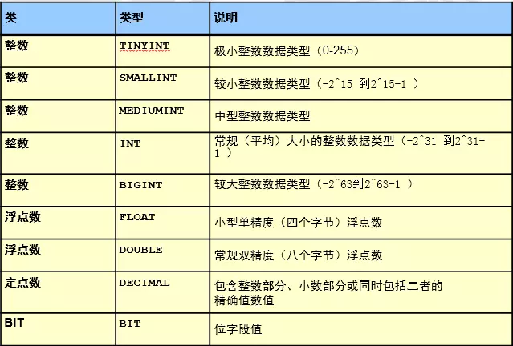
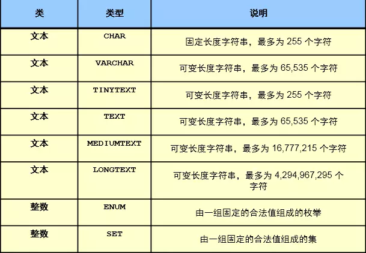
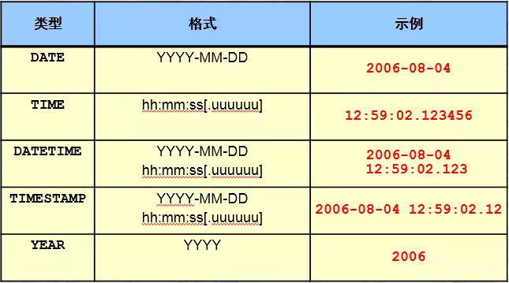
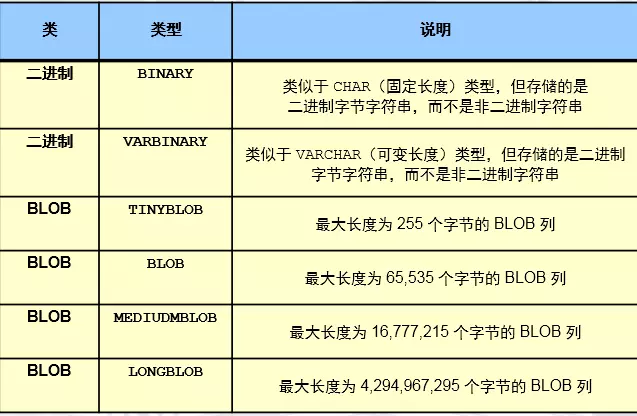

### mysql-sql层应用

#### sql简介

```
结构化查询语言，适用于所有关系型数据库
mysql5.7版本以后，符合SQL92严格模式
通过sql_mode参数来控制
```

#### mysql中常用的sql分类

```
DDL：数据定义语言
DCL：数据控制语言
DML：数据操作语言
DQL：数据的查询语言
```

#### 数据库逻辑对象

```
库
表
	表名
	表属性
		存储引擎，字符集，校对规则(也叫排序规则，会影响到排序)。
	列名
	列属性
		数据类型，约束条件，非空，唯一等
	行(记录)
```

#### 数据类型

##### 作用

```
数据类型保证数据的准确性和标准性。更严谨的约束数据。
```

##### 数字类型



```
tinyint  ： -128~127 1(bytes)字节 = 0000000-1111111 -128~127之间
int       ：-2^31~2^31-1 4(bytes)字节= 000xxxxx0000-1111xxxxx1111 
说明：手机号是无法存储到int的。一般是使用char类型来存储收集号
```

##### 字符类型



```
char(11) ：
	定长 的字符串类型,在存储字符串时，最大字符长度11个，立即分配11个字符长度的存储空间，如果存不满，空格填充。
varchar(11):
	变长 的字符串类型看，最大字符长度11个。在存储字符串时，自动判断字符长度，按需分配存储空间。255个字符以内，占用一个位置，超过255，超过255，占用2个字符
	
定长和变长体现在存储的空间大小是否定长和变长

enum('bj','tj','sh')：
	枚举类型，比较适合于将来此列的值是固定范围内的特点，可以使用enum,可以很大程度的优化我们的索引结构。里面带有内部索引，如要修改的话，会在查询时造成长时间锁表。
```

##### 时间类型



```
DATETIME   8个字节
	范围为从 1000-01-01 00:00:00.000000 至 9999-12-31 23:59:59.999999。
TIMESTAMP  4个字节
	1970-01-01 00:00:00.000000 至 2038-01-19 03:14:07.999999。
timestamp会受到时区的影响
```

##### 二进制类型



#### 列属性

```
约束(一般建表时添加):
	**primary key** ：主键约束
		设置为主键的列，此列的值必须非空且唯一，主键在一个表中只能有一个，但是可以有多个列一起构成。
	**not null**      ：非空约束
		列值不能为空，也是表设计的规范，尽可能将所有的列设置为非空。可以设置默认值为0
	**unique key** ：唯一键
		列值不能重复
	**unsigned** ：无符号
		针对数字列，非负数。
	注意：
		非空加唯一在没有主键的情况下，mysql把其当成主键

其他属性:
	**key** :索引
		可以在某列上建立索引，来优化查询,一般是根据需要后添加
	**default**           :默认值
		列中，没有录入值时，会自动使用default的值填充
	**auto_increment**:自增长
		针对数字列，顺序的自动填充数据（默认是从1开始，将来可以设定起始点和偏移量）
	**comment ** : 注释

存储引擎：
	是针对表的属性，5.7版本以后默认使用innodb，
```

#### 字符集规则及校验规则

```
在创建表的时候必须要进行存储引擎的设定，方便以后的迁移和dba的工作
创建数据库的时候必须指定字符集，因为磁盘只能接受2进制或者16进制。
一般常用的是utf-8和utf-8mb4
有些特殊的拼音和emoji表情等utf8字符集不支持。
注意：
	库有字符集，表也有字符集，列也可以设置字符集。(一般从低版本升级的时候才设置列的字符集。)

规则校验：
	大小写是否敏感，一般会影响排序
```


