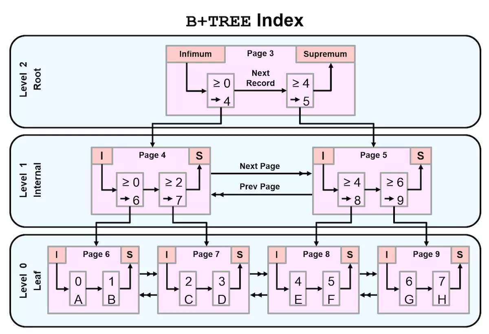

#### 索引及执行计划

##### 索引

###### 1.什么是索引

```
相当于书中的目录，方便查找。目的是为了优化查询。
```

###### 2.MySQL中支持的索引种类

```
B树索引(查找算法，像文件系统xfs，使用的就是btree)
R树索引
hash索引
full text
GIS(地理位置)
```

###### 3.B树的查找算法

```
b-tree
b+tree
b*tree(增强的b树)
注意：
	btree是有二分法逐步的演变成的
```

###### 4.btree原理图



```
root:根节点
internal:分支节点
leaf:叶子节点

btree的查找算法：
	每一个节点存放下一层节点的最小值和指向该节点(数据页)的指针。
b+tree的查找算法：
	在叶子节点之间都做了一个双向的指针，优化范围查找，而不像btree查找，每次都从根开始
b*tree的查找算法：
	在分支节点上又做了一个双向的指针，比b+tree更方便的查找，节省遍历次数，减少io操作。
	
在做等值的查找时，三种算法没有什么优劣的区分(区分不大，还是b*tree的查找算法快一些)，但是在范围查找的时候，b+tree和b*tree的查找算法将使用更少的查找次数，减少io操作，提升性能(使用查找算法也是优化的一部分)
```

btree总结

```
btree如何生成：
	1.将所有的值进行排序，均匀的落到叶子节点上(数据页16k)
	2.提取每个叶子节点的最小值，生成分支节点，并存储对应叶子节点的指针。
	3.提取分支节点的最小值，最终生成根节点，并存储对应分支节点的指针。
btree查找过程：
	1.对所要的值，根据根节点进行判断，选择下层分支节点的page页，在根据分支节点找到叶子节点概值对应的位置
	2.b+tree在叶子节点添加了双向指针，来优化范围查找(在范围查询方面提供了更好的性能(> < >= <= like))
	3.b*tree在b+tree的基础上在分支节点上增加了另一个双向指针(也是继续优化范围查找)
```


